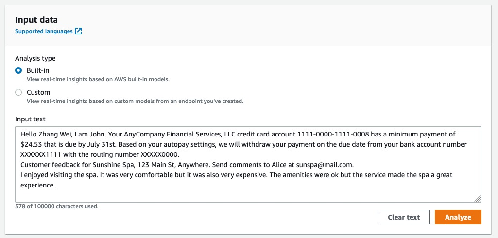

# Lab session #3: Basic use of the cloud

#  Tasks for Lab session #3

Go to the AWS Academy course named "AWS Academy Cloud Foundations" and follow the laboratories shown below.

Provide screeenshots of the major milestones and your explanation about what you have learned or observed. It does not have to be a repetition of the course but your own thoughts and conclusions. Write your feedback in the README.md file linking the images appropiatedly.

## Task 3.1: Introduction to AWS IAM

**Module 4 - AWS Cloud Security** Lab 1 - Introduction to AWS IAM

## Task 3.2: Build your VPC and Launch a Web Server

**Module 5 - Networking and Content Delivery** Lab 2 - Build your VPC and Launch a Web Server

## Task 3.3: Introduction to Amazon EC2

**Module 6 - Compute** Lab 3 - Introduction to Amazon EC2

## Task 3.4: use AWS Comprehend 

Go to the course "AWS Academy Learner Lab", open the modules and open the "Learner Lab". Click the button "Start Lab", wait until the environment is up and then click "AWS" at the top of the window and open the AWS Console.

<p align="center"></p>

Once the AWS Console is open find the service "Amazon Comprehend"

<p align="center"></p>

Launch the demo
<p align="center"></p>

Play with the demo using the provided text and parts of the "First contact with tensor flow" book.

<p align="center"></p>

## Task 3.5: Create a python script that sends a text to AWS Comprehend and retrieves the analysis

- Create a user that can access the AWS Comprehend Service
- Create the API credentials for that user
- Create a Python Script that submits a text to AWS Comprehend and obtains the list of entities used

**More details to be added**

# How to submit this assignment:

Use the **private** repo named *https://github.com/CCBDA-UPC/2023-3-xx*. It needs to have, at least, two files `README.md` with your responses to the above questions and `authors.json` with both members email addresses:

```json5
{
  "authors": [
    "FIRSTNAME1.LASTNAME1@estudiantat.upc.edu",
    "FIRSTNAME2.LASTNAME2@estudiantat.upc.edu"
  ]
}
```


Make sure that you have updated your local GitHub repository (using the `git`commands `add`, `commit` and `push`) with all the files generated during this session. 

**Before the deadline**, all team members shall push their responses to their private *https://github.com/CCBDA-UPC/2023-3-xx* repository.