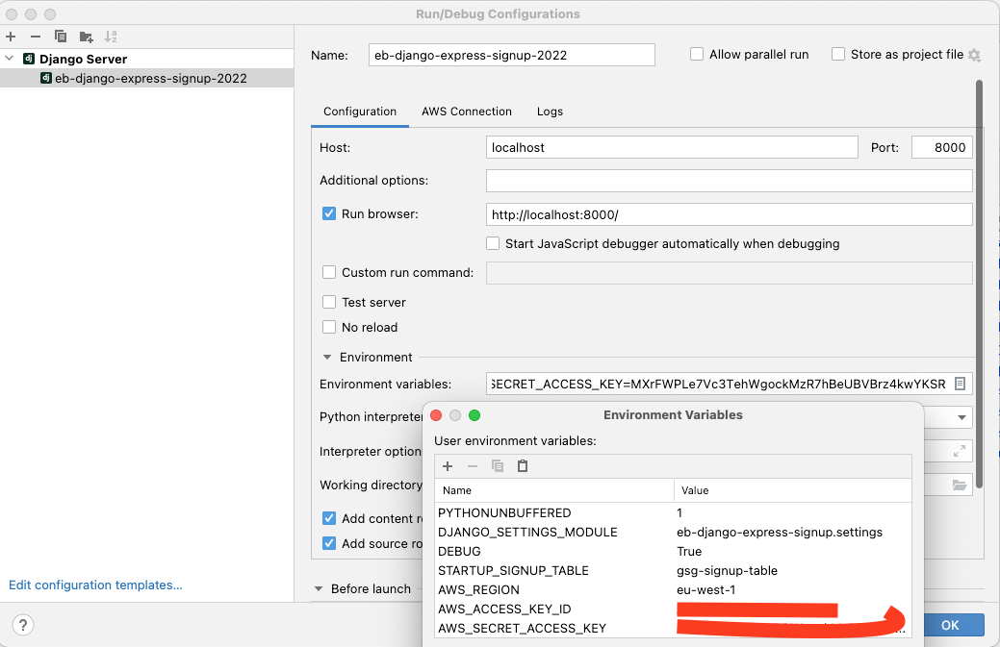

# Lab session #4: Basic use of the cloud

#  Tasks for Lab session #3

Go to the AWS Academy course named "AWS Academy Cloud Foundations" and follow the laboratories shown below.

Provide screeenshots of the major milestones and your explanation about what you have learned or observed. It does not have to be a repetition of the course but your own thoughts and conclusions. Write your feedback in the README.md file linking the images appropiatedly.

## Task 4.1: AWS Lambda

Follow the lab session:  **Module 6 - Compute** *Activity - AWS Lambda*

## Task 4.2: AWS Elastic Beanstalk

Follow the lab session: **Module 6 - Compute** *Activity - AWS Elastic Beanstalk*

## Task 4.3: Databases

Follow the training provided at **Module 8 - Databases** and answer the Knowledge Check. 

Follow the lab session: **Module 8 - Databases** *Lab 5 - Build a Database Server*

## Task 4.4: Deploy your web application

We are going to assume that you are working on a new subject on Cloud Computing that isn't ready for students to enroll yet, but in the meantime, you plan to deploy a small placeholder app that collects contact information from the website visitors who sign up to hear more. The signup app will help you reach potential students who might take part in a private beta test of the laboratory sessions.

The app will allow your future students to submit contact information and express interest in a preview of the new subject on Cloud Computing that you're developing.

To make the app look good, we use [Bootstrap](https://getbootstrap.com/), a mobile-first front-end framework that started as a Twitter project.

### Download the code for the Web App
You are going to make a few changes to the base Python code. Therefore, download the repository on your local disk drive as a *[zip file](eb-signup.zip)*. Unzip the file and change the name of the folder to *eb-django-express-signup*.

Prepare a new **private** repository in GitHub named `eb-django-express-signup` to commit all the changes to your code. Invite `angeltoribio-UPC-BCN` to your new remote private repository as a collaborator.

**Do not mix** the repository containing the course answers with the repository that holds the changes to your web app.

### Create a DynamoDB Table
Our signup app uses a DynamoDB table to store the contact information that users submit.

#### To create a DynamoDB table

1. Open the DynamoDB console at [https://console.aws.amazon.com/dynamodb/home](https://console.aws.amazon.com/dynamodb/home).

2. In the menu bar, ensure that the region is set to **Ireland**.

3. Choose **Create table**.

4. For Table name, type **gsg-signup-table**.

5. For the `Primary key`, type `email`. Choose **Create**.

#### Test the web app locally

Once you are inside the directory of the project issue the following commands to setup the configuration of the project using the process environment variables:

```
_$ export DEBUG=True
_$ export STARTUP_SIGNUP_TABLE=gsg-signup-table
_$ export AWS_REGION=eu-west-1
_$ export AWS_ACCESS_KEY_ID=<YOUR-ACCESS-KEY-ID>
_$ export AWS_SECRET_ACCESS_KEY=<YOUR-SECRET-ACCESS-KEY>
```

Update the contents of your environment variables by replacing **<YOUR-ACCESS-KEY-ID>** and **<YOUR-SECRET-ACCESS-KEY>** with the values of the **credentials.csv** file that you previously downloaded after creating the new User.

You can also type in the command line (make sure the above values have been replaced):

```
_$ source extra-files/environment.sh
```

**DO NOT EVER PUSH AWS CREDENTIALS TO YOUR PRIVATE REPOSITORY !!!**


Next, create a **new Python 3.8 virtual environment** specially for this web app and install the packages required to run it. (**MS-Windows OS** users read the note at the end of this section)

Check the contents of the file **requirements.txt** that the web application declares as the set of Python packages, and its version, that it requires to be executed successfully.

The package `boto3` is a library that hides de AWS REST API to the programmer and manages the communication between the web app and all the AWS services. Check [**Boto 3 Documentation**](https://boto3.readthedocs.io/en/latest/reference/services/index.html) for more details.

Please, note the different prompt **(eb-virt)_$** vs. **_$** when you are inside and outside of the new Python virtual environment.

```
_$ virtualenv -p python3 ../eb-virt
_$ source ../eb-virt/bin/activate
(eb-virt)_$ pip install -r requirements.txt
```

You will now need to run a local testing server.

```
(eb-virt)~$ python manage.py runserver
System check identified no issues (0 silenced).
January 04, 2023 - 18:57:49
Django version 2.1.2, using settings 'eb-django-express-signup.settings'
Starting development server at http://127.0.0.1:8000/
Quit the server with CONTROL-C.
(eb-virt)_$ deactivate
```
Check that you have configured the access to DynamoDB correctly by interacting with the web app through your browser [http://127.0.0.1:8000/](http://127.0.0.1:8000/).

Go to the DynamoDB browser tab and verify that the **gsg-signup-table** table contains the new records that the web app should have created. If all the above works correctly, you are almost ready to transfer the web app to AWS Beanstalk.

**NOTE I**: Make sure that you understand that we are using two types of environments: the *process environment*, holding the variables used to configure the web application and the *Python environment* to keep only the packages that the web app is using.

Every time that you open a new process, the process environment variables need to be re-instantiated either manually or by some automatism such as adding them to your .bashrc setup file, PyCharm environment setup, Elastic Beanstalk environment setup, or another suitable method.

We are creating a new Python virtual environment locally only to keep the packages that the web app uses. Having a small Python environment implies a faster web app startup and avoids, as much as possible, any hidden dependencies and ambiguities.

That Python virtual environment is re-created remotely by Elastic Beanstalk through the use of the file *requirements.txt* and other configuration that you are going to set up later. 

**NOTE II**: PyCharm provides a way to store and provide the environment variables for each execution. Besides, using PyCharm **you will be able to debug your code easily**.

<p align="center"></p>

<a name="Tasks45"/>

#### Create the AWS Beanstalk environment and deploy the sample web app

##### Prepare some configuration for AWS Beanstalk

At the repository, you already have a `requirements.txt` file that lets AWS Beanstalk know which Python modules your web app needs. As you advance in this hands-on, you are going to install more Python modules, and you need to update `requirements.txt`. Please note that you first need to switch to the virtual environment to update the file.

```
_$ source ../eb-virt/bin/activate
(eb-virt)_$ pip freeze > requirements.txt
(eb-virt)_$ deactivate
```

The Beanstalk environment uses the following command to install the exact version of packages that our web app needs.

```
(eb-virt)_$ pip install -r requirements.txt
```

Another important set of files are the ones at the `.ebextensions` directory. The files in that directory include instructions for AWS Beanstalk to start the web app and set up the timezone, amongst other required setups.


# How to submit this assignment:

Use the **private** repo named *https://github.com/CCBDA-UPC/2023-4-xx*. It needs to have, at least, two files `README.md` with your responses to the above questions and `authors.json` with both members email addresses:

```json5
{
  "authors": [
    "FIRSTNAME1.LASTNAME1@estudiantat.upc.edu",
    "FIRSTNAME2.LASTNAME2@estudiantat.upc.edu"
  ]
}
```

1. Create some screen captures of your:
- DyanmoDB table with the data of the new leads.
- Make sure you have written your responses to the above questions in `README.md`.
2. Add any comment that you consider necessary at the end of the 'README.md' file

Make sure that you have updated your local GitHub repository (using the `git`commands `add`, `commit` and `push`) with all the files generated during this session. 

**Before the deadline**, all team members shall push their responses to their private *https://github.com/CCBDA-UPC/2023-4-xx* repository.
